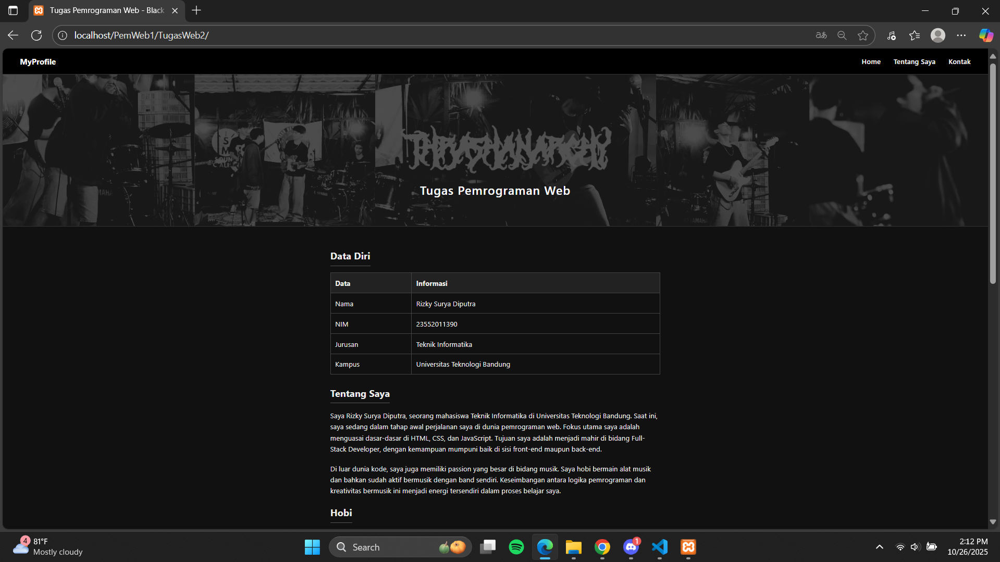
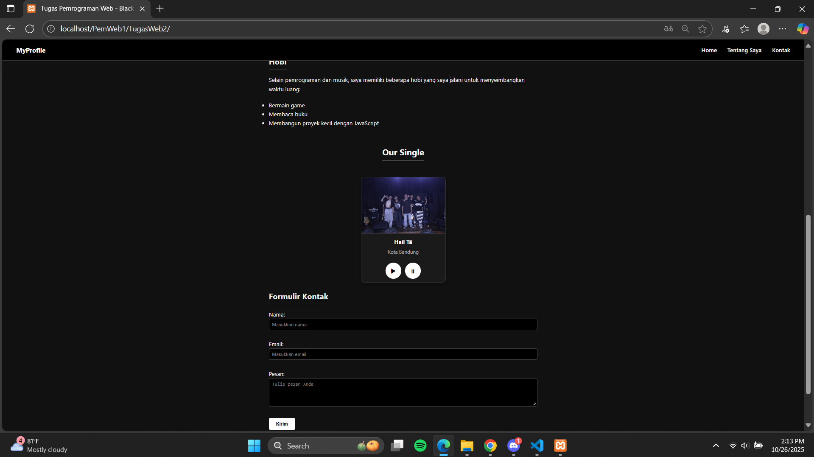
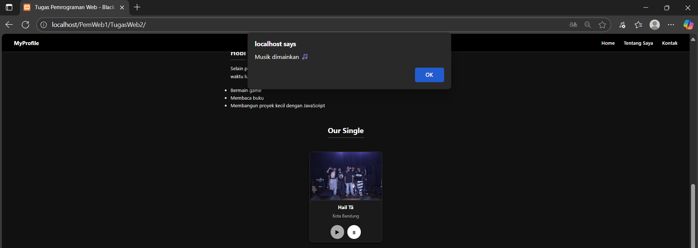
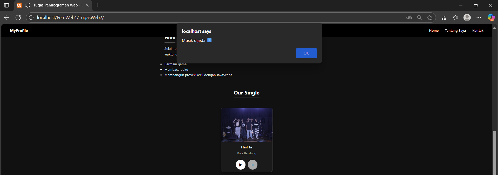

# 🌑 Tugas Pemrograman Web

Website ini dibuat sebagai **tugas Pemrograman Web** oleh **Rizky Surya Diputra** (NIM 23552011390)  
Universitas Teknologi Bandung.

## 📄 Fitur
- Navigasi sederhana (Home, Tentang, Kontak)
- Tampilan header dengan background bergambar
- Tabel data diri
- Bagian deskripsi tentang diri dan hobi
- Formulir kontak

## ⚙️ Interaksi (JavaScript)
Fitur interaktif menggunakan JavaScript sederhana:

Tombol Fungsi Aksi JavaScript
▶ Memutar musik | `audio.play()` |
⏸ Menjeda musik | `audio.pause()` |
Alert Notifikasi pemutaran | `alert("Musik dimainkan 🎵")` & `alert("Musik dijeda ⏸️")` |

Musik yang digunakan: **Suap Binatang.mp3**  

## 🖼️ Tampilan Website

Berikut hasil tampilan website saya:

